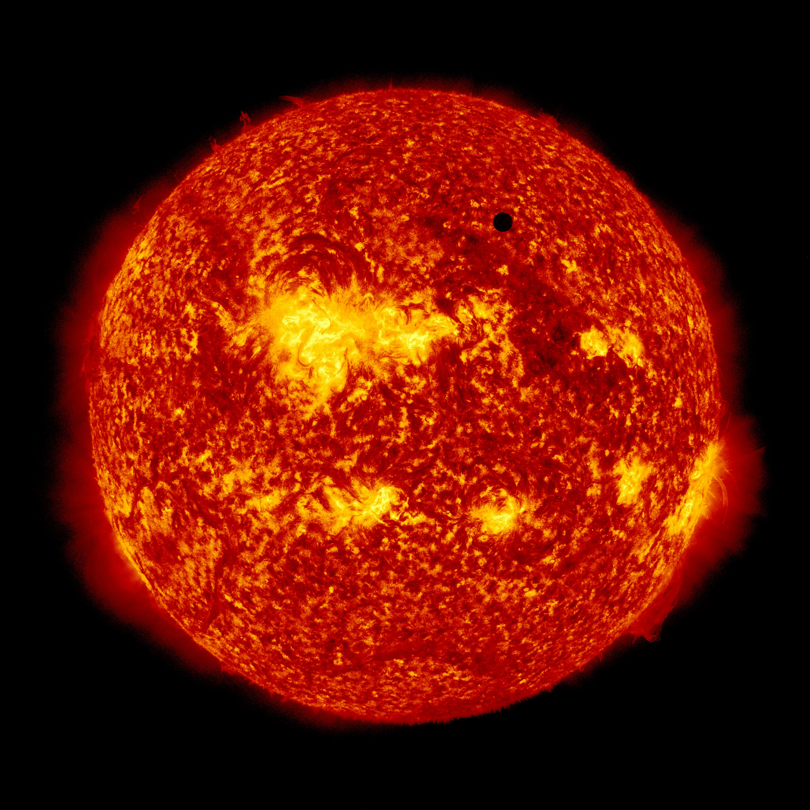

# Space weather.

A project to understand the solar cycle of our sun.

To-do:
- Go back to basics e.g. data.describe()
- Explore prediction models from <a href="https://www.statsmodels.org/dev/index.html">statsmodels.org</a>
- Try implimenting Autoregressive integrated moving average

